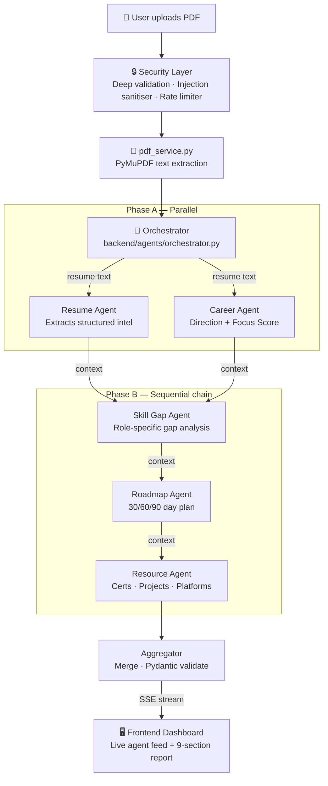

<div align="center">

# 🎯 Career Guardian AI

### *AI-Powered Career Intelligence — Multi-Agent Resume Analysis*

[](https://python.org)
[](https://fastapi.tiangolo.com)
[](https://ai.google.dev)
[](#multi-agent-architecture)
[](#security-features)
[](LICENSE)

> Career Guardian AI is a multi-agent AI system that analyzes resumes, detects career focus, identifies skill gaps, generates personalized growth roadmaps, and recommends certifications, projects, and opportunities.

Instead of acting as another ATS checker, Career Guardian AI answers a more important question:

Does your resume tell a clear career story❓ 

</div>

---

## 🧭 The Problem

Most resume tools ask: *"Will an ATS pass this?"*

Career Guardian AI asks: *"Is this resume sending the right signal about who you are and where you're headed?"*

**The core insight:** Students building resumes often target 4–5 career paths simultaneously — AIML + Frontend + Backend + Cloud + Android. This confuses recruiters and weakens positioning. Career Guardian AI detects this problem and guides users toward career clarity.

---

## 🏗️ Multi-Agent Architecture

Five specialist agents coordinate through a shared context object. Each agent receives the outputs of all prior agents, enabling true context chaining — not just parallel API calls.



### Agent Responsibilities

| Agent | Phase | Input | Output | File |
|-------|-------|-------|--------|------|
| **Resume Agent** | A (parallel) | Raw resume text | Structured extraction: skills, projects, education, experience | `agents/resume_agent.py` |
| **Career Agent** | A (parallel) | Raw text + Resume Agent output | Career direction, confidence score, **Focus Score** (flagship) | `agents/career_agent.py` |
| **Skill Gap Agent** | B (sequential) | Resume + Career outputs | Missing skills with priority (High/Med/Low) and learning resources | `agents/skill_gap_agent.py` |
| **Roadmap Agent** | B (sequential) | All prior outputs | 30/60/90-day action plan addressing identified gaps | `agents/roadmap_agent.py` |
| **Resource Agent** | B (sequential) | All prior outputs | Certifications, portfolio projects, opportunity platforms | `agents/resource_agent.py` |

### ADK Compatibility

All agents inherit from `BaseAgent` which mirrors the [Google ADK](https://google.github.io/adk-docs/) interface:

```python
class BaseAgent:
    name: str          # ADK-required
    description: str   # ADK-required

    async def run(self, context: AgentContext) -> AgentResult:
        ...            # ADK-compatible entry point
```

Agents can be dropped into an ADK runner without modification by replacing the `Orchestrator` with `google.adk.Runner`.

---

## ⭐ Focus Score — Flagship Feature

The centrepiece of Career Guardian AI. A weighted composite score measuring how well a resume is aligned to a single career direction.

```
Focus Score = Skill Alignment    × 40%
            + Project Alignment  × 25%
            + Cert Alignment     × 15%
            + Exp Alignment      × 10%
            + Consistency        × 10%
```

| Score | Category | Meaning |
|-------|----------|---------|
| 90–100 | ✅ Highly Focused | Resume tells one clear story |
| 70–89 | 🟡 Mostly Focused | Minor scattered signals |
| 50–69 | 🟠 Mixed | Targeting 2–3 directions |
| 0–49 | 🔴 Unfocused | Resume confuses recruiters |

---

## ✨ All Features

| # | Feature | Agent | Description |
|---|---------|-------|-------------|
| 1 | **Resume Intelligence** | Resume Agent | Structured extraction of all resume sections |
| 2 | **Career Direction** | Career Agent | Primary + secondary role with confidence % |
| 3 | **Focus Score** ⭐ | Career Agent | Weighted 5-dimension focus analysis |
| 4 | **Resume Rating** | Career Agent | Overall score + 6 subscores with explanations |
| 5 | **Skill Gap Analysis** | Skill Gap Agent | Missing skills by priority + learning resources |
| 6 | **Growth Roadmap** | Roadmap Agent | 30/60/90-day personalised action plan |
| 7 | **Certification Advisor** | Resource Agent | Real certs only, with cost and URLs |
| 8 | **Project Recommendations** | Resource Agent | Portfolio projects targeting detected gaps |
| 9 | **Opportunity Guide** | Resource Agent | Curated platforms with direct links |

---

## 🔒 Security Features

Production-grade security across four layers:

### 1 — Prompt Injection Sanitiser
Detects and neutralises adversarial patterns embedded in PDF text ("resume poisoning").
```
Patterns blocked: ignore previous instructions · you are now · act as · DAN ·
                  jailbreak · new instructions · system prompt · XML tags · chat tokens
```
File: `backend/utils/security.py` → `sanitise_resume_text()`

### 2 — Rate Limiter
Token-bucket implementation, keyed by hashed IP. 10 requests/hour per IP. Zero external dependencies.

File: `backend/utils/security.py` → `RateLimiter`

### 3 — Deep PDF Validation
Beyond magic bytes — validates cross-reference table, page objects, blocks embedded JavaScript and PE executables.

File: `backend/utils/security.py` → `deep_validate_pdf()`

### 4 — Audit Logger
JSON-line structured logging. Records IP hash, file metadata, injection attempts, and agent timings. **No resume content ever stored.**

File: `backend/utils/security.py` → `write_audit_log()`

---

## 🚀 Live Demo & Deployment

**Live URL:** [https://career-guardian-ai.onrender.com](https://career-guardian-ai.onrender.com)

## render.yaml (committed to repo root)
services:
  - type: web
    name: career-guardian-ai
    runtime: python
    buildCommand: pip install -r requirements.txt
    startCommand: uvicorn backend.main:app --host 0.0.0.0 --port $PORT
    healthCheckPath: /health
```

### Deploy your own fork in 3 steps:
1. Fork this repo
2. Connect to [render.com](https://render.com) → New Web Service → select repo
3. Add `GEMINI_API_KEY` in Render environment variables → Deploy

---

## 📡 API Reference

| Method | Endpoint | Description |
|--------|----------|-------------|
| `POST` | `/api/analyze` | Full analysis, returns complete JSON |
| `POST` | `/api/stream` | **SSE stream** — live per-agent events + final result |
| `GET` | `/api/agents` | Metadata for all 5 registered agents |
| `GET` | `/health` | Liveness check + agent list |
| `GET` | `/docs` | Interactive Swagger UI |

### SSE Event Types (`/api/stream`)

```
event: agent_start  data: {"agent": "resume_agent", "label": "Extracting resume intelligence"}
event: agent_done   data: {"agent": "resume_agent", "success": true, "duration": 3.2}
event: complete     data: { ...full AnalysisResponse JSON... }
event: error        data: {"error": "...", "message": "..."}
```

---

## 🗂️ Project Structure

```
Career-Guardian-AI/
│
├── backend/
│   ├── main.py                        # FastAPI app, CORS, lifespan hooks
│   ├── agents/                        # ← Multi-agent system
│   │   ├── base_agent.py              # ADK-compatible BaseAgent + AgentContext
│   │   ├── orchestrator.py            # Pipeline coordinator + SSE emitter
│   │   ├── resume_agent.py            # Structured resume extraction
│   │   ├── career_agent.py            # Career direction + Focus Score
│   │   ├── skill_gap_agent.py         # Role-specific gap analysis
│   │   ├── roadmap_agent.py           # 30/60/90-day growth plan
│   │   └── resource_agent.py          # Certs, projects, opportunities
│   ├── routes/
│   │   └── analysis.py                # POST /analyze · POST /stream · GET /agents
│   ├── services/
│   │   ├── pdf_service.py             # PyMuPDF extraction + validation
│   │   └── analysis_service.py        # Pipeline entry + audit logging
│   ├── models/
│   │   └── schemas.py                 # Pydantic models for all 9 sections
│   └── utils/
│       ├── helpers.py                 # Text sanitiser, JSON parser
│       └── security.py                # Injection sanitiser, rate limiter, audit log
│
├── frontend/
│   ├── index.html                     # SPA with live agent feed UI
│   ├── style.css                      # Dark theme, responsive, animation
│   └── script.js                      # SSE client + full dashboard renderer
│
├── render.yaml                        # One-file Render.com deployment
├── .env.example                       # Environment variable template
├── requirements.txt
└── README.md
```

---

## 🧪 Test Personas & Expected Outputs

### Persona 1 — AIML Focused
```
Skills: Python, TensorFlow, PyTorch, Scikit-learn, Pandas, NumPy, SQL
Projects: Image Classifier, Sentiment Analysis API, Fraud Detection Model
Certs:   TensorFlow Developer Certificate, Kaggle ML Course
Exp:     ML Intern at startup (3 months)
```
**Expected:** Primary = AIML Engineer · Confidence ≥ 85% · Focus Score ≥ 78 · Category = Mostly Focused

### Persona 2 — Full Stack Developer
```
Skills: React, TypeScript, Node.js, Express, PostgreSQL, REST APIs, Docker
Projects: E-commerce platform, Real-time chat app, REST API boilerplate
Certs:   Meta Frontend Developer Certificate
Exp:     Full Stack Intern
```
**Expected:** Primary = Full Stack Developer · Confidence ≥ 80% · Focus Score ≥ 72 · Category = Mostly Focused

### Persona 3 — Unfocused (Control Case)
```
Skills: Python, React, Docker, TensorFlow, Kotlin (Android), Metasploit, SQL, ML
Projects: Android app, ML classifier, React dashboard, pentest lab
Certs:   AWS Cloud Practitioner, Google Android, Kaggle Python
Exp:     None
```
**Expected:** Primary = Software Engineer (low confidence) · Focus Score ≤ 32 · Category = Unfocused

---

## 🏁 Kaggle Course Concepts Coverage

| Course Concept | Implementation | Location |
|----------------|----------------|----------|
| **Multi-Agent System** | 5 specialist agents with shared AgentContext | `backend/agents/` |
| **Agent Skills** | Each agent is a typed, callable skill with I/O contracts | `backend/agents/base_agent.py` |
| **ADK Compatible** | `BaseAgent` mirrors Google ADK interface (`name`, `description`, `run()`) | `backend/agents/base_agent.py` |
| **Security Features** | Prompt injection sanitiser, rate limiter, deep PDF validation, audit log | `backend/utils/security.py` |
| **Deployability** | `render.yaml` + live URL, zero-config deploy | `render.yaml` |
| **Streaming (Antigravity)** | SSE agent feed — live per-agent progress in browser | `backend/routes/analysis.py` |

---

## ⚙️ Local Setup

### Prerequisites
- Python 3.11+
- Gemini API key → [aistudio.google.com](https://aistudio.google.com/app/apikey)

```bash
# 1. Clone
git clone https://github.com/yourusername/Career-Guardian-AI.git
cd Career-Guardian-AI

# 2. Virtual environment
python -m venv venv
source venv/bin/activate        # Windows: venv\Scripts\activate

# 3. Install dependencies
pip install -r requirements.txt

# 4. Configure environment
cp .env.example .env
# Edit .env → add GEMINI_API_KEY=your_key_here

# 5. Run
uvicorn backend.main:app --reload --host 0.0.0.0 --port 8000

# Open: http://localhost:8000
# API docs: http://localhost:8000/docs
# Agent list: http://localhost:8000/api/agents
```

---

## 🔮 Future Roadmap

- [ ] **v2.1** — PDF report export (download full analysis as PDF)
- [ ] **v2.2** — Resume diff mode (before vs. after improvements)
- [ ] **v2.3** — Full Google ADK runner integration
- [ ] **v2.4** — MCP server — expose resume analysis as an MCP tool
- [ ] **v3.0** — LinkedIn profile text analysis (paste text, no scraping)
- [ ] **v3.1** — Multi-language resume support (Hindi, Spanish, French)
- [ ] **v3.2** — Role-specific focus scoring (startup vs. enterprise vs. research)

---

## 🛠️ Tech Stack

| Layer | Technology |
|-------|-----------|
| AI Engine | Google Gemini 1.5 Flash |
| Agent Framework | Custom (ADK-compatible BaseAgent) |
| Backend | FastAPI 0.111 + Python 3.11 |
| PDF Parsing | PyMuPDF (fitz) |
| Validation | Pydantic v2 |
| Streaming | Server-Sent Events (SSE) |
| Frontend | Vanilla HTML / CSS / JS |
| Deployment | Render.com (`render.yaml`) |

---

## 📄 License

MIT License — see [LICENSE](LICENSE) for details.

---

<div align="center">

**Career Guardian AI** — Built for students. Powered by Gemini. Guided by clarity.

⭐ Star this repo if it helped you understand your career direction.

</div>
