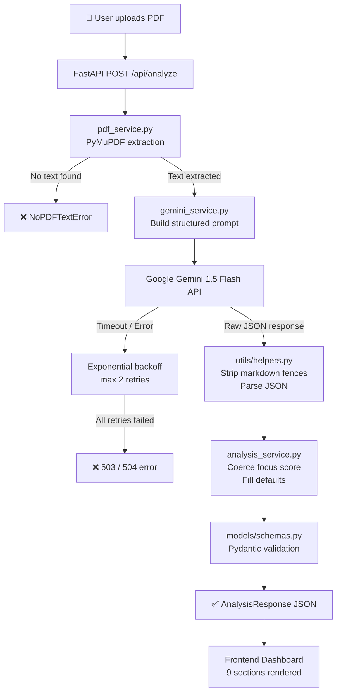
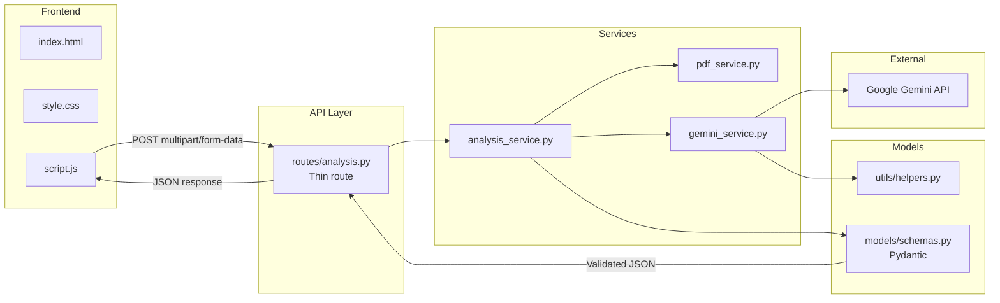

# 🎯 Career Guardian AI

<div align="center">


[](https://python.org)
[](https://fastapi.tiangolo.com)
[](https://ai.google.dev)
[](LICENSE)
[](CONTRIBUTING.md)

**AI-Powered Career Intelligence Agent**
*Resume Analysis · Career Direction Discovery · Skill Gap Detection · Professional Growth Planning*

[Features](#-features) · [Demo](#-demo) · [Installation](#-installation) · [Architecture](#-architecture) · [Roadmap](#-roadmap)

</div>

---

## 🧭 What is Career Guardian AI?

Career Guardian AI is **not** a job recommender. It is **not** a generic ATS checker.

It is an **AI Career Mentor** that helps students and professionals answer the questions most tools ignore:

| Question | What Career Guardian Answers |
|---|---|
| *"Is my resume focused?"* | Focus Score — the flagship feature |
| *"What career am I actually suited for?"* | Career Direction Detection |
| *"What am I missing to get there?"* | Skill Gap Analysis |
| *"What should I build next?"* | Project Recommendation Engine |
| *"How do I grow over the next 90 days?"* | Personalised Growth Roadmap |
| *"Which certifications actually matter?"* | Certification Advisor |
| *"Where should I look for opportunities?"* | Opportunity Guide |

> **Core insight:** Many students build resumes targeting 4–5 career paths at once (AIML + Frontend + Backend + Cloud + Android). This confuses recruiters and weakens positioning. Career Guardian AI detects this and guides users toward clarity.

---

## ✨ Features

### 🔮 Focus Score *(Flagship Feature)*
The centrepiece of the platform. A weighted composite score that measures how well a resume is aligned to a single career direction.

```
Focus Score = Skill Alignment (40%)
            + Project Alignment (25%)
            + Certification Alignment (15%)
            + Experience Alignment (10%)
            + Resume Consistency (10%)
```

| Score Range | Category |
|---|---|
| 90 – 100 | ✅ Highly Focused |
| 70 – 89 | 🟡 Mostly Focused |
| 50 – 69 | 🟠 Mixed |
| 0 – 49 | 🔴 Unfocused |

### 🧠 Career Direction Analyzer
Detects primary and secondary career directions with a confidence score and detailed reasoning.

### 📊 Resume Rating
Overall score (0–100) with six subscores: Skills, Projects, Certifications, Experience, Presentation, and Focus.

### 🔍 Skill Gap Analysis
Based on detected primary role. Every missing skill includes a priority level (High / Medium / Low) and an explanation of why it matters.

### 🗺️ Personalised Growth Roadmap
30-day, 60-day, and 90-day action plans with specific tasks, how-to details, and expected outcomes.

### 📜 Certification Advisor
Real certifications only (no made-up ones), categorised as Beginner / Intermediate / Advanced, with reasoning specific to the user's resume.

### 🛠️ Project Recommendation Engine
Portfolio projects aligned with detected career direction, with difficulty levels and skills learned.

### 🌐 Opportunity Guide
Curated list of platforms to find opportunities — with context on why each one fits this specific person.

### 📄 Resume Intelligence Extraction
Structured extraction of name, email, education, skills, projects, experience, certifications, achievements, and a generated summary.

---

## 🖼️ Screenshots

> *Screenshots will be added after first deployment.*

| Upload Screen | Focus Score Dashboard |
|---|---|
| `[Screenshot Placeholder]` | `[Screenshot Placeholder]` |

| Skill Gap Analysis | Growth Roadmap |
|---|---|
| `[Screenshot Placeholder]` | `[Screenshot Placeholder]` |

---

## 🏗️ Architecture

### Data Flow



### Service Architecture



---

## 🗂️ Folder Structure

```
Career-Guardian-AI/
│
├── backend/
│   ├── __init__.py
│   ├── main.py                   # FastAPI app, CORS, static file serving
│   ├── routes/
│   │   ├── __init__.py
│   │   └── analysis.py           # POST /api/analyze
│   ├── services/
│   │   ├── __init__.py
│   │   ├── pdf_service.py        # PyMuPDF text extraction + validation
│   │   ├── gemini_service.py     # Gemini API calls + retry logic
│   │   └── analysis_service.py   # Orchestration + Pydantic coercion
│   ├── models/
│   │   ├── __init__.py
│   │   └── schemas.py            # All Pydantic models + fallback helpers
│   └── utils/
│       ├── __init__.py
│       └── helpers.py            # Text sanitisation, JSON parsing, timeout
│
├── frontend/
│   ├── index.html                # Single-page app shell
│   ├── style.css                 # Dark theme, responsive grid
│   └── script.js                 # Upload, API call, dashboard render
│
├── .env                          # ⚠️ Never commit this
├── .env.example                  # Safe template — commit this
├── requirements.txt
└── README.md
```

---

## 🚀 Installation

### Prerequisites

- Python 3.10 or higher
- A Google Gemini API key → [Get one here](https://aistudio.google.com/app/apikey)

### 1. Clone the repository

```bash
git clone https://github.com/yourusername/Career-Guardian-AI.git
cd Career-Guardian-AI
```

### 2. Create a virtual environment

```bash
python -m venv venv

# macOS / Linux
source venv/bin/activate

# Windows
venv\Scripts\activate
```

### 3. Install dependencies

```bash
pip install -r requirements.txt
```

### 4. Configure environment variables

```bash
cp .env.example .env
```

Open `.env` and add your Gemini API key:

```env
GEMINI_API_KEY=your_actual_api_key_here
```

### 5. Run the application

```bash
uvicorn backend.main:app --reload --host 0.0.0.0 --port 8000
```

### 6. Open in browser

```
http://localhost:8000
```

---

## 🔑 Environment Variables

| Variable | Required | Description |
|---|---|---|
| `GEMINI_API_KEY` | ✅ Yes | Google Gemini API key from [aistudio.google.com](https://aistudio.google.com/app/apikey) |

---

## 🔌 API Reference

### `POST /api/analyze`

Analyse a resume PDF and return full career intelligence.

**Request**
```
Content-Type: multipart/form-data
Field: resume (PDF file, max 10 MB)
```

**Response (200 OK)**
```json
{
  "resume_intelligence": { ... },
  "career_direction": {
    "primary": "AIML Engineer",
    "secondary": "Backend Developer",
    "confidence": 87,
    "reasoning": "..."
  },
  "focus_score": {
    "score": 72,
    "category": "Mostly Focused",
    "skill_alignment": 80,
    "project_alignment": 75,
    ...
  },
  "resume_rating": { "overall": 68, "subscores": { ... } },
  "skill_gap": { "role": "AIML Engineer", "missing_skills": [...] },
  "growth_roadmap": { "day_30": [...], "day_60": [...], "day_90": [...] },
  "certifications": [...],
  "projects": [...],
  "opportunities": [...]
}
```

**Error responses**

| Code | Error Key | When |
|---|---|---|
| 400 | `invalid_file` | Non-PDF or file > 10 MB |
| 400 | `no_text` | Scanned/image-only PDF |
| 503 | `gemini_quota` | API quota exceeded |
| 504 | `timeout` | Analysis took > 25 seconds |
| 500 | `analysis_failed` | Unexpected failure |

### `GET /health`

```json
{ "status": "ok", "gemini_key_configured": true }
```

---

## 🧪 Test Resumes

Three sample personas for testing expected behaviour:

### Persona 1 — AIML Focused
```
Skills: Python, TensorFlow, PyTorch, Scikit-learn, Pandas, NumPy, SQL
Projects: Image Classifier, Sentiment Analysis API, Fraud Detection Model
Certs: TensorFlow Developer Certificate, Kaggle ML Course
Experience: ML Intern at startup
```
**Expected:** Primary = AIML Engineer · Focus Score ≈ 85 · Category = Mostly Focused

### Persona 2 — Full Stack
```
Skills: React, Node.js, Express, PostgreSQL, REST APIs, Docker
Projects: E-commerce platform, Chat app with WebSockets, REST API boilerplate
Certs: Meta Frontend Developer
Experience: Full Stack Intern
```
**Expected:** Primary = Full Stack Developer · Focus Score ≈ 78 · Category = Mostly Focused

### Persona 3 — Highly Unfocused
```
Skills: Python, React, Docker, TensorFlow, Android (Kotlin), Cybersecurity basics, SQL, ML
Projects: Android app, ML classifier, React dashboard, penetration testing lab
Certs: Mix of AWS, Google, Android
Experience: None
```
**Expected:** Primary = Software Engineer (uncertain) · Focus Score ≈ 28 · Category = Unfocused

---

## 🛡️ Error Handling Summary

| Scenario | Handled By | User Message |
|---|---|---|
| Non-PDF upload | `pdf_service.py` | "Only PDF files are accepted (max 10 MB)." |
| Scanned PDF | `pdf_service.py` | "Upload a text-based PDF. Scanned image PDFs are not supported." |
| File > 10 MB | `pdf_service.py` | "File exceeds the 10 MB limit." |
| Gemini quota | `gemini_service.py` | "AI service quota exceeded. Please try again later." |
| Gemini timeout | `gemini_service.py` | "Analysis timed out after 25 seconds." |
| Invalid JSON | `helpers.py` | Falls back to safe defaults via Pydantic |
| Network error | `script.js` | "Network error. Please check your connection." |
| Request timeout | `script.js` | "Request timed out. Please try again." |

---

## 🔮 Future Roadmap

- [ ] **v1.1** — PDF export of the full analysis report
- [ ] **v1.2** — Resume comparison (before vs. after improvements)
- [ ] **v1.3** — LinkedIn profile URL analysis (no scraping — user pastes text)
- [ ] **v1.4** — Multi-language resume support
- [ ] **v2.0** — Side-by-side role comparison (e.g. AIML vs Data Science)
- [ ] **v2.1** — Industry-specific focus scoring (startup vs enterprise vs research)
- [ ] **v2.2** — Weekly growth check-in via email digest

---

## 🤔 Why Career Guardian AI?

Most resume tools answer: *"Will an ATS pass this?"*

Career Guardian AI answers: *"Is this resume sending the right signal about who you are and where you're headed?"*

That is a fundamentally different — and more valuable — question for students and early-career professionals who are still figuring out their direction.

---

## 👨‍💻 Tech Stack

| Layer | Technology |
|---|---|
| Backend | FastAPI, Python 3.10+ |
| AI Engine | Google Gemini 1.5 Flash |
| PDF Parsing | PyMuPDF (fitz) |
| Validation | Pydantic v2 |
| Frontend | Vanilla HTML / CSS / JS |
| Environment | python-dotenv |
| Server | Uvicorn (ASGI) |

---

## 📄 License

```
MIT License

Copyright (c) 2024 Career Guardian AI

Permission is hereby granted, free of charge, to any person obtaining a copy
of this software and associated documentation files (the "Software"), to deal
in the Software without restriction, including without limitation the rights
to use, copy, modify, merge, publish, distribute, sublicense, and/or sell
copies of the Software, and to permit persons to whom the Software is
furnished to do so, subject to the following conditions:

The above copyright notice and this permission notice shall be included in all
copies or substantial portions of the Software.

THE SOFTWARE IS PROVIDED "AS IS", WITHOUT WARRANTY OF ANY KIND, EXPRESS OR
IMPLIED, INCLUDING BUT NOT LIMITED TO THE WARRANTIES OF MERCHANTABILITY,
FITNESS FOR A PARTICULAR PURPOSE AND NONINFRINGEMENT.
```

---

<div align="center">

**Career Guardian AI** — Built for students. Powered by Gemini. Guided by clarity.

⭐ Star this repo if it helped you understand your career direction.

</div>
